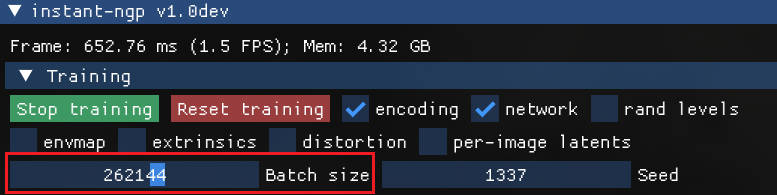

## Run instant-ngp

(When capturing, it is recommended to take photos of the object to be reconstructed from different angles and distances, and try to keep the object in the center of the frame at all times. The recommended length of the video is 30s-60s.)

(It is recommended to locate the video in an empty folder, because the program will generate a lot of temporary files)

```
.\run <ur video absolute path>
# example
# .\run C:\xxx\xxx.mp4
```

Supported gpu architectures:
```
Pascal
Turing
Ampere
Ada
```

adjust patch size when gpu is out of memory
